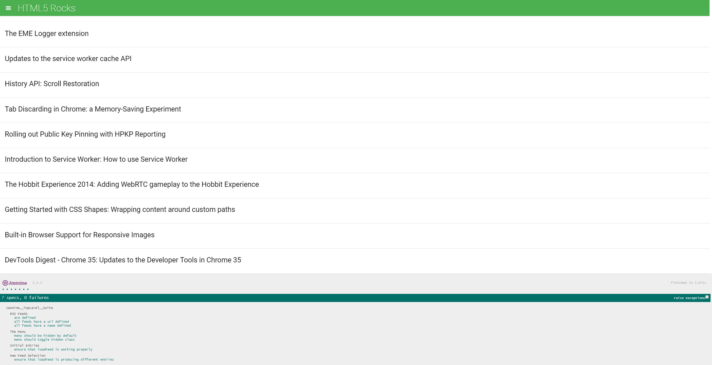

# feedReader
Creating tests for another person's feed reader app using the Jasmine.js test suite.

## TABLE OF CONTENTS

* [Getting Started](getting-started)
* [Credits](credits)

## GETTING STARTED

In order to start testing, you need to download the files and then run the index.html file in your browser of choice. The app.js file is where all of the feed functionality is while the Jasmine test suites are in the feedreader.js file.

## SCREENSHOTS

## CREDITS
Some solutions to certain tests were found online using StackOverflow, the Jasmine.js documentation and udacity's studen hub. Here are a few links.

### Jasmine documentation
> https://jasmine.github.io/

### jQuery click testing
> https://stackoverflow.com/questions/50190192/test-jquery-click-event-with-jasmine